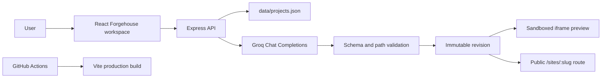

<div align="center">

# Forgehouse

### Describe the site. Shape the system. Publish the next version.

[](https://github.com/vincenzo-afk/AI-IDE/actions/workflows/ci.yml) [](LICENSE) [](https://nodejs.org/)

[Repository](https://github.com/vincenzo-afk/AI-IDE) · [Report a bug](https://github.com/vincenzo-afk/AI-IDE/issues/new?template=bug_report.md) · [Request a feature](https://github.com/vincenzo-afk/AI-IDE/issues/new?template=feature_request.md)

</div>

Forgehouse is a conversational AI website studio for creating, revising, previewing, and publishing browser-rendered websites. It is designed around the fast feedback loop associated with products such as Lovable and Bolt: a user describes a change, the server produces a safe revision, and the result appears immediately in an isolated preview.

> **Current release status:** Forgehouse now includes production-MVP foundations for account sessions, per-user project ownership, persistent storage, generation jobs, asset validation, rate limits, hardened publishing, and automated API verification. A managed database, object storage, external job queue, and independent per-project deployments remain future infrastructure upgrades.

## <a name="table-of-contents"></a>Table of Contents

- [About the Project](#about-the-project)
- [Tech Stack](#tech-stack)
- [Getting Started](#getting-started)
- [Usage](#usage)
- [API Reference](#api-reference)
- [Project Structure](#project-structure)
- [Features and Roadmap](#features-and-roadmap)
- [Testing and CI](#testing-and-ci)
- [Deployment](#deployment)
- [Contributing](#contributing)
- [Security](#security)
- [License](#license)
- [Acknowledgments](#acknowledgments)
- [Project Status](#project-status)
- [Support](#support)
- [Footer](#footer)

---

## <a name="about-the-project"></a>About the Project

Forgehouse addresses the gap between an idea and a working web experience. Instead of asking users to start with a blank code editor, it provides a studio where a natural-language request becomes a versioned change to a small browser-safe project. Every accepted change is stored as an immutable revision, the active revision is rendered in an iframe preview, and publishing selects the revision that powers the public site route.

The current starter experience is a responsive editorial landing page for a fictional creative studio called Northstar. The builder UI itself provides the product shell: project navigation, a conversational composer, device controls, a file drawer, revision history, and publication feedback.

### Key capabilities

- **Conversational editing:** submit a natural-language instruction such as “make the hero more editorial” or “change the palette to ocean blue.”
- **Groq-ready generation:** call Groq server-side with strict structured output when `GROQ_API_KEY` is configured.
- **Safe fallback mode:** continue previewing and testing deterministic visual edits before a Groq key is supplied.
- **Live browser preview:** render the current revision in a sandboxed iframe with desktop, tablet, and mobile viewport modes.
- **Immutable revisions:** retain previous versions and restore them by creating a new revision instead of deleting history.
- **Application-hosted publishing:** publish the selected revision at `/sites/:slug`.
- **Server-side secret handling:** keep Groq credentials out of Vite bundles and client-side code.
- **Build verification:** run the production Vite build and end-to-end API suite automatically through GitHub Actions.
- **Authentication:** register, sign in, sign out, and scope private projects to the authenticated owner.
- **Generation jobs:** observe queued, running, succeeded, failed, and cancelled states.
- **Asset handling:** upload validated image assets to protected project storage.
- **Operational controls:** use request IDs, readiness checks, rate limits, and safe error responses.

### Architecture overview



---

## <a name="tech-stack"></a>Tech Stack

| Area | Technologies | Verified details |
|---|---|---|
| Frontend | React, React DOM, TypeScript, Vite | React `^19.2.0`, React DOM `^19.2.0`, TypeScript `~5.8.2`, Vite `^6.2.0` |
| Backend | Node.js, Express | Express `^4.21.2`; server entrypoint is `server/index.js` |
| Preview runtime | Browser iframe and generated HTML/CSS/JavaScript | Preview uses `sandbox="allow-scripts"`; public output is served by Express |
| Data and storage | JSON file persistence | Runtime data is written to `data/projects.json`; the file is Git-ignored |
| AI integration | Groq OpenAI-compatible Chat Completions API | Uses `GROQ_API_KEY`, configurable `GROQ_MODEL`, and strict JSON Schema output |
| Build and operations | Vite, npm, GitHub Actions | CI installs dependencies and runs `npm run build` on `main` pushes and pull requests |
| Code quality | TypeScript compiler and Vite/esbuild transforms | The current package does not define a separate lint or test script |

The repository does not currently include a lockfile, Dockerfile, database migration layer, authentication provider, or cloud deployment manifest. Those omissions are documented rather than implied away.

---

## <a name="getting-started"></a>Getting Started

### Prerequisites

Install Node.js 22 or a compatible current Node.js release and npm. A Groq account and API key are optional for the current fallback-enabled development experience, but required for model-powered generation.

### Installation

```bash
git clone https://github.com/vincenzo-afk/AI-IDE.git
cd AI-IDE
npm install
cp .env.example .env
npm run dev
```

The development command starts the Express API on port `8787` and the Vite frontend on port `3000`. Open the Vite URL printed by the development server.

### Environment configuration

Copy `.env.example` to `.env` and add values for the server process. Do not prefix server secrets with `VITE_`, because Vite-prefixed variables are intended for browser exposure.

| Variable | Required | Default | Purpose |
|---|---:|---|---|
| `GROQ_API_KEY` | No for fallback mode; yes for Groq generation | Empty | Server-only Groq credential |
| `GROQ_MODEL` | No | `openai/gpt-oss-20b` | Groq model identifier used for structured site changes |
| `PORT` | No | `8787` | Express API and public-site server port |
| `FORGEHOUSE_DATA_DIR` | No | `./data` | Persistent directory for the JSON store and local assets |

### Production build

```bash
npm run build
npm start
```

`npm run build` produces the Vite bundle in `dist`. `npm start` launches `server/index.js`, which serves the generated bundle when `dist/index.html` exists and also serves public project pages under `/sites/:slug`.

### Data persistence

The current development persistence layer creates `data/projects.json` on first server start. This file is ignored by Git and should be replaced by a managed database or object-storage-backed repository before deploying a multi-user service.

---

## <a name="usage"></a>Usage

### Build and revise a site

1. Register or sign in to the Forgehouse workspace.
2. Choose an existing project or select **New project**.
3. Enter a request in the composer, for example `Change the palette to ocean blue`.
4. Select **Build change** or press `Command/Ctrl + Enter`.
5. Review the live preview and change summary.
6. Restore an earlier revision if needed, then publish the current revision.

When no Groq key is configured, the application still creates a new revision and applies the deterministic safe-preview transformations currently implemented by the server. With Groq configured, the server requests structured file changes and validates every returned path before storing the revision.

### Create a project with HTTP

```bash
curl -X POST http://localhost:8787/api/projects \\
  -H 'Content-Type: application/json' \\
  -d '{"name":"Acme launch page","description":"A new product landing page"}'
```

### Request a revision

```bash
curl -X POST http://localhost:8787/api/projects/PROJECT_ID/generate \\
  -H 'Content-Type: application/json' \\
  -d '{"prompt":"Make the headline more direct and use a blue palette"}'
```

### Publish a project

```bash
curl -X POST http://localhost:8787/api/projects/PROJECT_ID/publish
```

After publication, open `http://localhost:8787/sites/PROJECT_SLUG`.

---

## <a name="api-reference"></a>API Reference

The API currently has no authentication layer. Treat the development server as a trusted local process until authentication and authorization are added.

| Method | Path | Description |
|---|---|---|
| `GET` | `/api/health` | Returns server health and whether `GROQ_API_KEY` is configured. |
| `POST` | `/api/auth/register` | Creates an account and sets an HTTP-only session cookie. |
| `POST` | `/api/auth/login` | Starts an authenticated session. |
| `POST` | `/api/auth/logout` | Ends the current session. |
| `GET` | `/api/auth/me` | Returns the current safe user state. |
| `GET` | `/api/projects` | Returns the authenticated user’s project collection. |
| `POST` | `/api/projects` | Creates a project with the starter site revision. |
| `GET` | `/api/projects/:id` | Returns one project by identifier. |
| `POST` | `/api/projects/:id/generate` | Queues a revision job using Groq or the safe local fallback. |
| `GET` | `/api/projects/:id/jobs/:jobId` | Returns job status and the resulting project after success. |
| `POST` | `/api/projects/:id/jobs/:jobId/cancel` | Cancels queued or running work. |
| `POST` | `/api/projects/:id/revisions/:revisionId/restore` | Creates a new revision from an earlier revision. |
| `POST` | `/api/projects/:id/publish` | Publishes the current revision. |
| `POST` | `/api/projects/:id/unpublish` | Removes the project from the public route. |
| `POST` | `/api/projects/:id/assets` | Validates and stores an image asset for the project. |
| `GET` | `/api/assets/:id` | Serves an authorized or published asset. |
| `GET` | `/sites/:slug` | Serves the published revision as a browser-rendered HTML page. |

### Health response

```json
{"ok":true,"groqConfigured":false}
```

### Error behavior

The API returns JSON errors for missing projects, revisions, or prompts. A prompt longer than 4,000 characters returns HTTP `413`. Unknown routes return HTTP `404` JSON under `/api/` and the frontend shell for non-API routes when a production bundle exists.

---

## <a name="project-structure"></a>Project Structure

```text
.
├── .env.example                 # Server-only environment template
├── .github/
│   ├── ISSUE_TEMPLATE/          # Standardized issue forms
│   ├── PULL_REQUEST_TEMPLATE.md # Pull request checklist
│   └── workflows/               # CI, security, and release automation
├── App.tsx                      # Main Forgehouse workspace UI
├── CONTRIBUTING.md              # Contribution workflow
├── LICENSE                      # MIT license
├── README.md                    # Project documentation
├── index.html                   # Vite document shell
├── index.tsx                    # React entrypoint
├── package.json                 # Scripts and dependencies
├── server/index.js              # Express API and public site server
├── styles.css                   # Forgehouse UI and preview styling
├── tsconfig.json                # TypeScript compiler configuration
├── types.ts                    # Shared project, revision, and site-file types
└── vite.config.ts               # Vite plugin, proxy, and development server
```

`data/projects.json` and `dist/` are generated at runtime or build time and are intentionally excluded from version control.

---

## <a name="features-and-roadmap"></a>Features and Roadmap

### Implemented

- ✅ Conversational builder workspace
- ✅ Project creation and project switching
- ✅ Structured Groq generation path with safe fallback mode
- ✅ Strict generated-file path and size validation
- ✅ Sandboxed live preview
- ✅ Desktop, tablet, and mobile preview modes
- ✅ File drawer and revision change summary
- ✅ Immutable revision history and restore flow
- ✅ Publish and unpublish controls
- ✅ Public `/sites/:slug` pages with restrictive content security policy
- ✅ Build verification through GitHub Actions

### Next priorities

- Add user authentication and per-user project authorization.
- Replace JSON persistence with a managed database and object storage for larger assets.
- Add rate limits, request cancellation, job queues, and durable generation status.
- Add browser-level integration tests and server-side unit tests.
- Add independent deployments, custom domains, preview URLs, and deployment logs.
- Add collaborative workspaces and GitHub project synchronization as a product feature rather than only repository maintenance.

See the [open issues](https://github.com/vincenzo-afk/AI-IDE/issues) for tracked work.

---

## <a name="testing-and-ci"></a>Testing and CI

The repository defines a Node integration test suite and a production build check:

```bash
npm install
npm test
npm run build
```

GitHub Actions runs this build on pushes and pull requests targeting `main`. A separate security workflow performs CodeQL analysis where GitHub enables it for the repository. Until dedicated tests are added, review changes against the API behavior and security boundary described in this document.

---

## <a name="deployment"></a>Deployment

Forgehouse is a Node.js and Express application with a Vite frontend bundle. A compatible deployment must run `npm run build`, retain the server-only environment variables, and start the process with `npm start`.

A generic deployment sequence is:

```bash
npm install
npm run build
PORT=8787 GROQ_API_KEY=your_key GROQ_MODEL=openai/gpt-oss-20b npm start
```

The current repository does not contain a provider-specific deployment manifest. Configure the platform’s start command as `npm start`, expose the configured `PORT`, provide `GROQ_API_KEY` through the provider’s secret manager, and mount a persistent volume at `FORGEHOUSE_DATA_DIR` when using the JSON storage adapter. Do not commit `.env` files or API keys. For a production multi-user service, add a managed database, persistent storage, authentication, rate limiting, structured logs, and a dedicated untrusted-content isolation strategy before public launch.

---

## <a name="contributing"></a>Contributing

Contributions are welcome through GitHub pull requests. Please read [CONTRIBUTING.md](CONTRIBUTING.md), follow the [Code of Conduct](CODE_OF_CONDUCT.md), and review [SECURITY.md](SECURITY.md) before submitting changes.

Use short branches such as `feat/revision-diff`, `fix/preview-csp`, or `docs/setup-guide`. Write commit messages using [Conventional Commits](https://www.conventionalcommits.org/en/v1.0.0/), for example `feat: add revision diff panel` or `fix: reject unsafe generated paths`.

Every pull request should explain the behavior change, list verification commands, describe any environment-variable impact, and call out changes to the public-site security boundary. Keep generated data, local `.env` files, and build artifacts out of commits.

---

## <a name="security"></a>Security

Forgehouse handles untrusted natural-language prompts and model-produced site files. The generation pipeline limits file paths to browser-safe project files, caps prompt and file sizes, stores revisions transactionally, keeps the Groq key server-side, and renders previews in a sandboxed iframe. Public pages add a restrictive content security policy.

The application now has account sessions, per-user ownership checks, request throttling, and persistent local storage. For a public multi-user launch, replace the local JSON adapter with a managed database and object storage, add a durable worker queue, and configure production session and observability infrastructure.

Please report vulnerabilities privately through the repository’s [security advisory workflow](https://github.com/vincenzo-afk/AI-IDE/security/advisories/new) rather than opening a public issue. See [SECURITY.md](SECURITY.md) for supported versions and reporting expectations.

---

## <a name="license"></a>License

Forgehouse is released under the [MIT License](LICENSE). Copyright © 2026 vincenzo-afk.

---

## <a name="acknowledgments"></a>Acknowledgments

Forgehouse is inspired by conversational development environments that shorten the loop between a product idea and a working web experience. The project uses React, Vite, Express, TypeScript, and GitHub Actions, and integrates with Groq’s OpenAI-compatible chat completions API for structured website generation.

---

## <a name="project-status"></a>Project Status

The repository is actively evolving from a client-only AI studio into a full-stack website-building product. The current branch preserves the original source in `backup-before-ai-builder-2026-08-21` while `main` contains the Forgehouse rewrite and production-polish files.

---

## <a name="support"></a>Support

For product questions, open a [discussion or issue](https://github.com/vincenzo-afk/AI-IDE/issues). For a security concern, follow the private reporting process in [SECURITY.md](SECURITY.md). Deployment-specific support depends on the hosting provider selected for the project.

---

## <a name="footer"></a>Footer

[Back to top](#forgehouse)

Built with care by **vincenzo-afk**.
